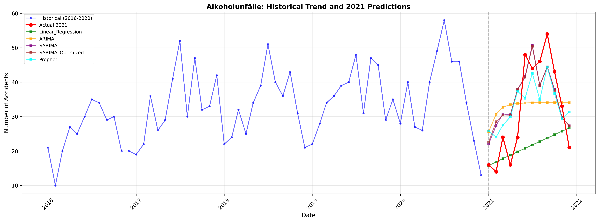

# DPS Alkoholunfälle Prediction Model

This project predicts alcohol-related traffic accidents (Alkoholunfälle) using time series analysis.

## Project Structure

```
├── data/                    # Training data
├── prediction/              # Prediction results and visualizations
├── predict_alkohol.py       # Model training and evaluation script
├── app.py                   # Flask API for predictions
├── requirements.txt         # Python dependencies
└── README.md               # This file
```

## Models Tested

- Linear Regression (Trend + Seasonality)
- ARIMA(1,1,1)
- SARIMA(1,1,1)(1,1,1,12) ✓ Best performing
- SARIMA(2,1,2)(1,1,1,12) Optimized
- Prophet (Facebook)

## Best Model

**SARIMA(1,1,1)(1,1,1,12)** achieved the lowest Mean Absolute Error (MAE) of 8.23.

## Prediction Results

See [prediction_results_2021.csv](prediction/prediction_results_2021.csv) for detailed monthly predictions.



## API Usage

### Endpoint

```
POST /predict
```

### Request Body

```json
{
  "year": 2021,
  "month": 10
}
```

### Response

```json
{
  "prediction": 23.45
}
```

## Local Development

1. Install dependencies:
```bash
pip install -r requirements.txt
```

2. Run the API:
```bash
python app.py
```

3. Test the API:
```bash
curl -X POST http://localhost:5000/predict \
  -H "Content-Type: application/json" \
  -d '{"year": 2021, "month": 10}'
```

## Deployment

This application is deployed on Render and can be accessed at the deployment URL.
