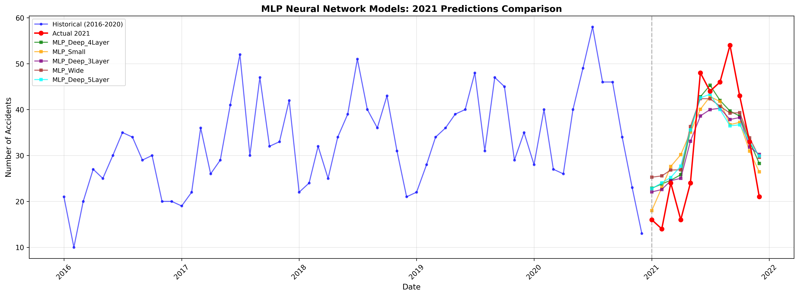
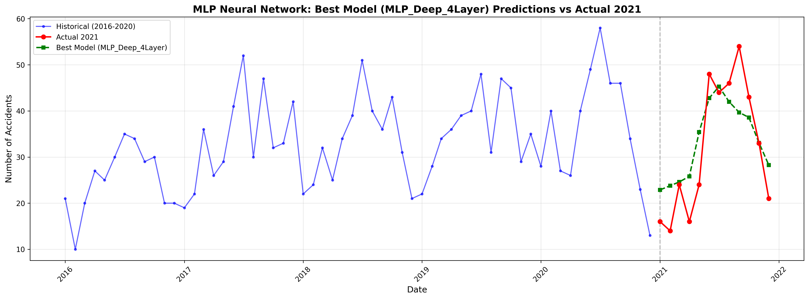

# Munich Alcohol-Related Traffic Accidents Prediction

This project predicts monthly alcohol-related traffic accidents (Alkoholunfälle) in Munich using machine learning. The API is powered by a **Multi-Layer Perceptron (MLP) Neural Network** trained on historical data from the [Munich Open Data Portal](https://opendata.muenchen.de/dataset/monatszahlen-verkehrsunfaelle/resource/40094bd6-f82d-4979-949b-26c8dc00b9a7).

## 🚀 Quick Start

### Online API (Recommended)

The API is deployed and ready to use at: **https://munich-alcohol-accidents-prediction.onrender.com**

```bash
curl -X POST https://munich-alcohol-accidents-prediction.onrender.com/predict \
  -H "Content-Type: application/json" \
  -d '{"year": 2021, "month": 1}'
```

Response:
```json
{"prediction": 24.12}
```

### API Documentation

FastAPI provides interactive API documentation:
- **Swagger UI**: https://munich-alcohol-accidents-prediction.onrender.com/docs
- **ReDoc**: https://munich-alcohol-accidents-prediction.onrender.com/redoc

### Local Development

1. Install dependencies:
```bash
pip install -r requirements.txt
```

2. Run the FastAPI server:
```bash
python3 app_fastapi.py
```

3. Test locally:
```bash
curl -X POST http://localhost:8000/predict \
  -H "Content-Type: application/json" \
  -d '{"year": 2021, "month": 1}'
```

Or use the test script:
```bash
python test_api.py
```

## 🎯 Model Performance

### Selected Model: MLP Neural Network

**Architecture**: 120-80-40-20 (4 hidden layers)
**Performance (MAE)**: 6.26 - Best among all tested models

The model was trained on historical data up to December 2020 and validated on 2021 data.

### Prediction Results


*Comparison of different MLP architectures tested*


*Best MLP model predictions vs actual 2021 values*

### Detailed Results

- [mlp_prediction_results_2021.csv](prediction/mlp_prediction_results_2021.csv) - Monthly predictions for 2021
- [mlp_model_summary.csv](prediction/mlp_model_summary.csv) - Model performance metrics

## 📁 Project Structure

```
├── data/                      # Training data from Munich Open Data Portal
├── prediction/                # MLP model prediction results
│   ├── mlp_best_model_vs_actual.png
│   ├── mlp_all_models_comparison.png
│   ├── mlp_prediction_results_2021.csv
│   └── mlp_model_summary.csv
├── scripts/                   # Data analysis and visualization scripts
├── visualization/             # EDA visualizations
├── app_fastapi.py            # FastAPI application (Production)
├── app.py                    # Flask API (Legacy)
├── test_api.py               # API testing script
└── requirements.txt          # Python dependencies
```

## 🔌 API Reference

### Endpoints

#### GET /
Get API information and model details.

```bash
curl https://munich-alcohol-accidents-prediction.onrender.com/
```

#### GET /health
Health check endpoint.

```bash
curl https://munich-alcohol-accidents-prediction.onrender.com/health
```

#### POST /predict
Get prediction for a specific month and year.

**Request:**
```json
{
  "year": 2021,
  "month": 1
}
```

**Response:**
```json
{
  "prediction": 24.12
}
```

**Example:**
```bash
curl -X POST https://munich-alcohol-accidents-prediction.onrender.com/predict \
  -H "Content-Type: application/json" \
  -d '{"year": 2021, "month": 1}'
```

### Error Handling

The API returns appropriate error messages for invalid inputs:

- Missing fields: `{"error": "Both 'year' and 'month' are required"}`
- Invalid month: `{"error": "Month must be between 1 and 12"}`
- Past dates: `{"error": "Cannot predict for past dates. Training data ends at 2020-12"}`
- Future limit: `{"error": "Predictions only available up to 5 years in the future"}`

## 🚀 Deployment

The application is deployed on [Render](https://render.com) and automatically updates when changes are pushed to the main branch.

**Live API:** https://munich-alcohol-accidents-prediction.onrender.com

## 📝 License

This project is for educational and research purposes.
