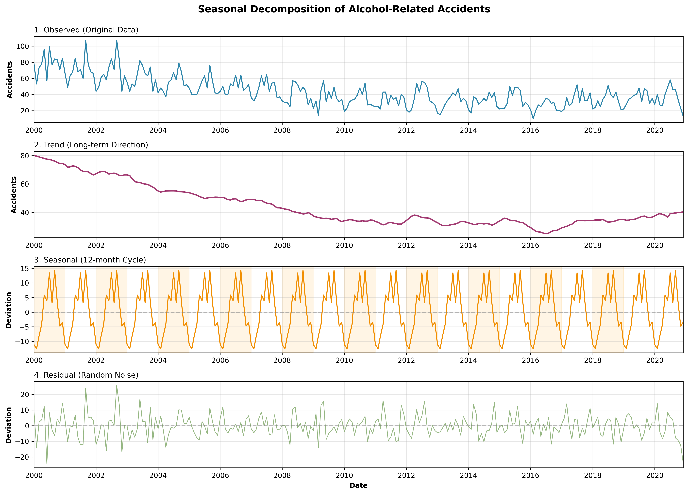
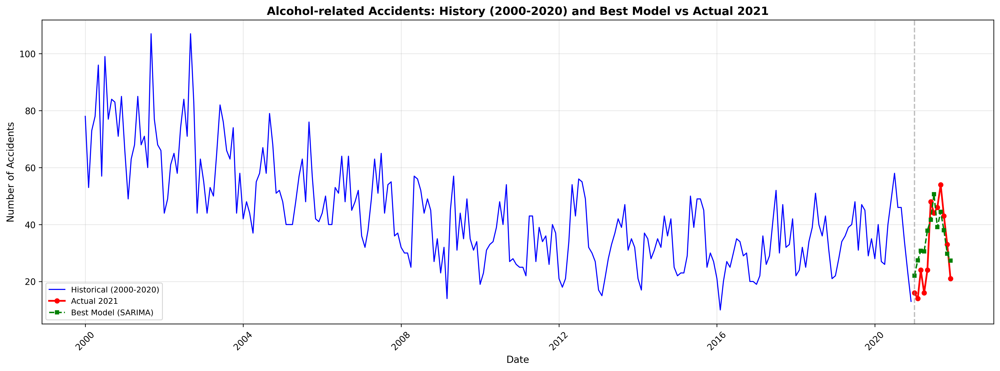

# DPS Alkoholunfälle Prediction Model

This project predicts alcohol-related traffic accidents (Alkoholunfälle) in Munich using time series analysis. The model is trained on historical data from [Munich Open Data Portal](https://opendata.muenchen.de/dataset/monatszahlen-verkehrsunfaelle/resource/40094bd6-f82d-4979-949b-26c8dc00b9a7) and provides predictions for future months.

## 🚀 Quick Start

### Online API (Recommended)

The API is deployed and ready to use at: **https://alkoholunfaelle-prediction.onrender.com**

```bash
curl -X POST https://alkoholunfaelle-prediction.onrender.com/predict \
  -H "Content-Type: application/json" \
  -d '{"year": 2021, "month": 1}'
```

Response:
```json
{"prediction": 22.05}
```

### Local Development

1. Install dependencies:
```bash
pip install -r requirements.txt
```

2. Run the API locally:
```bash
python app.py
```

3. Test locally:
```bash
curl -X POST http://localhost:8000/predict \
  -H "Content-Type: application/json" \
  -d '{"year": 2021, "month": 1}'
```

Or use the test script:
```bash
python test_api.py
```
The test script includes comprehensive test cases for API validation, error handling, and various prediction scenarios.

## 📊 Data Analysis & Model Selection

### Data Source
The training data is sourced from the [Munich Open Data Portal](https://opendata.muenchen.de/dataset/monatszahlen-verkehrsunfaelle/resource/40094bd6-f82d-4979-949b-26c8dc00b9a7), containing monthly statistics of traffic accidents in Munich.

### Time Series Patterns

The historical data shows clear seasonal patterns and trends in alcohol-related accidents:


*Seasonal decomposition showing trend, seasonality, and residuals*

## 🎯 Models Tested

Multiple time series models were evaluated:

- Linear Regression (Trend + Seasonality)
- ARIMA(1,1,1)
- **SARIMA(1,1,1)(1,1,1,12)** ✓ Best performing
- SARIMA(2,1,2)(1,1,1,12) Optimized
- Prophet (Facebook)

### Best Model Performance

**SARIMA(1,1,1)(1,1,1,12)** achieved the lowest Mean Absolute Error (MAE) of **8.23**.


*Comparison of best model predictions vs actual values*

## 📈 Prediction Results

Detailed prediction results are available in:
- [prediction_results_2021.csv](prediction/prediction_results_2021.csv) - Monthly predictions for 2021
- [model_summary.csv](prediction/model_summary.csv) - Full model comparison summary

## 📁 Project Structure

```
├── data/                         # Training data from Munich Open Data Portal
├── scripts/                      # Data analysis and visualization scripts
│   ├── acf_pacf.py              # ACF/PACF analysis
│   ├── filter.py                # Data filtering utilities
│   ├── heatmap.py               # Heatmap generation
│   ├── monthly_visualization.py # Monthly trend analysis
│   ├── seasonal_decomposition.py # Seasonal decomposition
│   └── yearly_visualization.py  # Yearly trend analysis
├── visualization/                # Generated EDA visualizations
├── prediction/                   # Prediction results and model comparisons
├── select_predict_model.py       # Model training and evaluation script
├── app.py                        # Flask API for predictions
├── test_api.py                   # API testing script
├── requirements.txt              # Python dependencies
└── README.md                    # This file
```

## 🔌 API Reference

### Endpoints

#### GET /
Get API information and model details.

```bash
curl https://alkoholunfaelle-prediction.onrender.com/
```

#### POST /predict
Get prediction for a specific month and year.

**Request:**
```json
{
  "year": 2021,
  "month": 1
}
```

**Response:**
```json
{
  "prediction": 22.05
}
```

**Example:**
```bash
curl -X POST https://alkoholunfaelle-prediction.onrender.com/predict \
  -H "Content-Type: application/json" \
  -d '{"year": 2021, "month": 1}'
```

### Error Handling

The API returns appropriate error messages for invalid inputs:

- Missing fields: `{"error": "Both 'year' and 'month' are required"}`
- Invalid month: `{"error": "Month must be between 1 and 12"}`
- Past dates: `{"error": "Cannot predict for past dates. Training data ends at YYYY-MM"}`
- Future limit: `{"error": "Predictions only available up to 10 years in the future"}`

## 🚀 Deployment

The application is deployed on [Render](https://render.com) and automatically updates when changes are pushed to the main branch.

**Live API:** https://alkoholunfaelle-prediction.onrender.com

## 📝 License

This project is for educational and research purposes.
